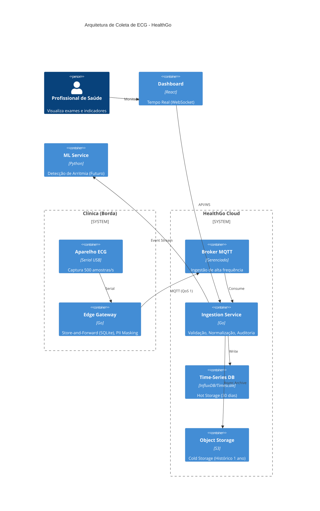

# Desafio Técnico: Arquiteto de Software - HealthGo

Esta documentação detalha a proposta de arquitetura para o sistema de coleta de ECG end-to-end, focando em resiliência de borda (edge), observabilidade e evolução sistêmica.

> **Documentação de Arquitetura:** Consulte a [Visão Macro (HLD)](HLD/Visao-Geral.md) para detalhes visuais e fluxo de alto nível.

## 1. Hipóteses Assumidas
Para guiar este projeto, definimos as seguintes premissas operacionais:
* **Volume:** O sistema suporta 500 amostras/s por dispositivo de forma constante.
* **Conectividade:** O ambiente de borda opera em modo offline-first; quedas de internet de até 30 min não devem resultar em perda de dados.
* **Infraestrutura:** A squad de infraestrutura é enxuta (2 pessoas), priorizando serviços gerenciados e automação (IaC) para reduzir o *toil* operacional.

## 2. Diagrama de Arquitetura (C4 Model)
*O diagrama abaixo descreve os componentes e fronteiras de rede. O código fonte está em `/diagrams/arquitetura-ecg.md`.*

## 3. ADRs (Decisões de Arquitetura)

### [ADR-001: Estratégia de Store-and-Forward na Borda](ADRs/ADR-001-Store-and-Forward.md)

- **Decisão:** Uso de SQLite local no Edge Gateway para persistência temporária (buffer).
    
- **Descartadas:** Buffer em memória (risco de perda total em queda de energia); Streaming direto (instabilidade de rede impede continuidade).
    
- **Trade-off:** Aumenta a complexidade de gestão de armazenamento na borda, mas garante a integridade dos dados (requisito inegociável).
    

### [ADR-002: Protocolo de Ingestão (MQTT)](ADRs/ADR-002-Protocolo-Ingestao.md)

- **Decisão:** MQTT (QoS 1) para telemetria.
    
- **Descartadas:** Kafka na borda (inviável para time de 2 pessoas gerenciar em 1.000 clínicas); REST/HTTP (overhead de headers inviabiliza banda instável).
    
- **Trade-off:** Exige configuração de Broker em nuvem, mas oferece eficiência de banda e resiliência superiores.
    

### [ADR-003: Armazenamento Híbrido (Tiered Storage)](ADRs/ADR-003-Armazenamento-Hibrido.md)

- **Decisão:** InfluxDB (30 dias) para acesso rápido e S3 (1 ano) para cold storage.
    
- **Descartadas:** RDBMS único (Postgres) devido à _write amplification_ com 500 amostras/s constantes.
    
- **Trade-off:** Aumenta complexidade de jobs de ETL, mas otimiza custos e performance do dashboard em tempo real.
    

## 4. Parte 2: Perguntas Escritas

### 1. Docker

(a) Estrutura com _multi-stage builds_ (build image + runtime image distroless/alpine) para segurança. Execução com usuário não-root e `--device=/dev/ttyUSB0` para acesso ao hardware. 

(b) `COPY` é executado em tempo de build (imutável na imagem); `cp` no host altera o ambiente em tempo de execução. `COPY` garante reprodutibilidade. 

(c) Inconsistência de permissões de acesso ao hardware (`/dev/ttyUSB0`) em diferentes kernels ou distros no host.

### 2. Mensageria

**MQTT** para telemetria.

- Trade-off 1 (Eficiência): Overhead mínimo de headers comparado a HTTP/Kafka, crucial para internet instável.
    
- Trade-off 2 (Operacional): Manter Broker gerenciado (ex: HiveMQ) é mais simples que gerenciar clusters Kafka na borda, alinhado ao tamanho da squad de infra.
    

### 3. Segurança

(a) OAuth2 é framework de autorização; OIDC adiciona camada de identidade (ID Token) sobre OAuth2, essencial para validar quem é o usuário (Médico no SSO vs App Mobile). 

(b) Risco de _Confused Deputy_ ou vazamento de Access Tokens. Sem OIDC, não há validação forte da identidade do usuário, apenas do acesso.

### 4. Banco de Dados

Estratégia: **Tiered Storage**. InfluxDB (Time-series) com TTL de 30 dias para dashboard (hot) e S3/Parquet para auditoria/ML (cold).

- Trade-off: Aceito a complexidade extra de jobs de arquivamento (ETL) em troca de alta performance de escrita contínua, evitando degradação no dashboard.
    

### 5. Visão Sistêmica

Caminho **(A) Fila MQTT dedicada ao ECG**.

- Justificativa: Isolamento de domínio evita "noisy neighbor" (picos de telemetria de ECG afetando outros produtos).
    
- Mitigação: Documentaria o protocolo como "Biblioteca Padrão HealthGo" (SDK interno) para padronizar ingestão, promovendo a infra de ECG como _enabler_ de arquitetura e realizando mentoria com times de dados/produtos para facilitar a adoção.

## 5. Stack Tecnológica e Ferramentas

### Desenvolvimento e Integração (CI/CD)

- **CI:** GitHub Actions para testes unitários, linting e análise de segurança (SAST).
    
- **CD (Cloud):** _Push-based_ via Terraform para provisionamento declarativo.
    
- **CD (Edge):** _Pull-based_ para implantações automáticas via Container Registry, eliminando acesso manual.
    

### Infraestrutura como Código (IaC)

- **Provisionamento:** Terraform para recursos em nuvem.
    
- **Configuração:** Ansible para padronização de ambiente nos _Edge Gateways_.
    

### Observabilidade

- **Métricas:** Prometheus para coleta de dados de infra e aplicação.
    
- **Visualização:** Grafana para monitoramento e alertas em tempo real.
    

## 6. Princípios Arquiteturais

1. **Resiliência:** Offline-first por design.
    
2. **Operabilidade:** Foco total em IaC para manter a squad enxuta.
    
3. **Escalabilidade:** Arquitetura desacoplada via Pub/Sub (MQTT) para permitir a evolução do sistema (ex: novos serviços de ML).